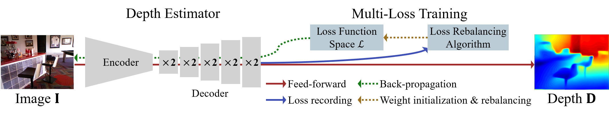

# [ECCV 2020] Multi-Loss Rebalancing Algorithm for Monocular Depth Estimation


------
## 1. Paper

If you use our code or results, please cite:

```
@InProceedings{Lee_2020_ECCV,
  author = {Lee, Jae-Han and Kim, Chang-Su},
  title = {Multi-Loss Rebalancing Algorithm for Monocular Depth Estimation}, 
  booktitle = {Proceedings of the European Conference on Computer Vision (ECCV)},
  year = {2020}
}
```

-------
## 2. Large files
Large files can be downloaded using the following link.

### 2.1. NYUv2 dataset
NYUv2 training and evaluation data are obtained by reprocessing what is provided on the [official site](https://cs.nyu.edu/~silberman/datasets/nyu_depth_v2.html). You can easily use the reprocessed data with the link below.

All depth maps are saved as 16bit png files.

Depths are mapped by the following formula: depth = double(value) / (2^16 - 1) * 10

- 654 RGBD pairs for evaluation: [test654.zip](https://drive.google.com/file/d/1JYjSgf5Fn6eg2gJkqmuBZXI2xMTdyIxX/view?usp=sharing)

- 795 RGBD pairs for training: [train795.zip](https://drive.google.com/file/d/1VNRsXzc0MMjjXLdJpcwBTh1eosif7orU/view?usp=sharing)

- RGBD pairs obtained from the training sequence: [train_reduced05.zip](https://drive.google.com/file/d/1s6-4mm-wDwo0bwEG1LKLsadjB0K5EosP/view?usp=sharing) (8 GB)

Dataset files should be placed in 'dataset' directory without extracting them.

### 2.2. Network model parameter file
Network model paramter files should be placed in 'models' directory without extracting them.

- PNASNet based model: [PNAS_model.pth](https://drive.google.com/file/d/1B1LdpOqIiyLN5JtzlDo-9nItiFIyfJeV/view?usp=sharing)

### 2.3. predicted depth maps
The prediction results of the proposed algorithm for the NYUv2 test split can be downloaded from the following link.

- [prediction results for test654.zip](https://drive.google.com/file/d/1X6YMCKWw9xwZ6CpZGhU5wQULEAT9Wonj/view?usp=sharing)


